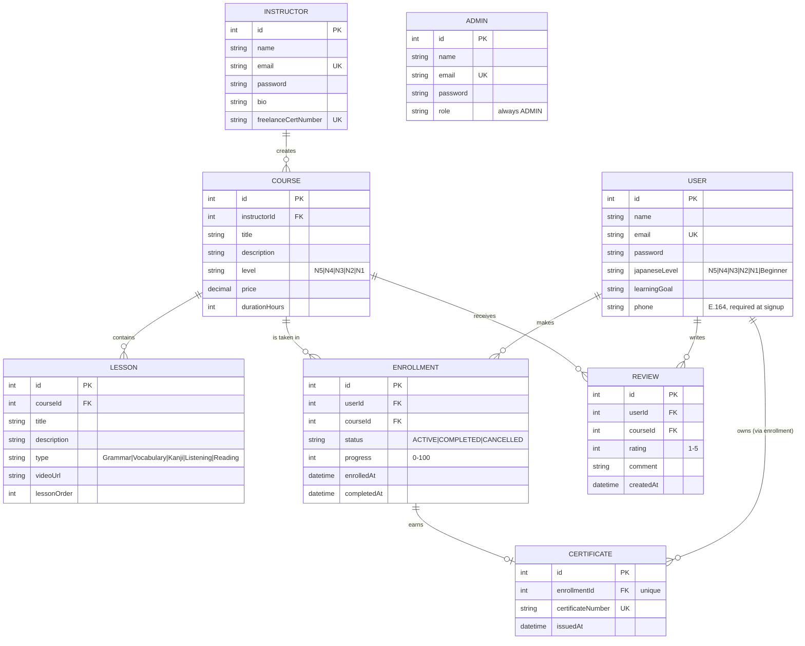

<p align="center">
  
</p>

<h1 align="center">Jisr 日本語プラットフォーム</h1>

<p align="center">
  <strong>A Spring Boot REST backend for a Japanese language learning platform</strong><br>
  Courses, enrollment tracking, verifiable certificates, reviews, and AI-powered study tools.
</p>

<p align="center">
  
  
  
  
  
  
</p>

<p align="center">
  <a href="#table-of-contents">Contents</a> •
  <a href="#getting-started">Setup</a> •
  <a href="#api-reference">API</a> •
  <a href="#testing-with-postman">Postman</a> •
  <a href="#license">License</a>
</p>

---

## Table of Contents

- [Features](#features)
- [Tech Stack](#tech-stack)
- [Architecture](#architecture)
- [Data Model](#data-model)
- [Prerequisites](#prerequisites)
- [Getting Started](#getting-started)
- [Configuration](#configuration)
  - [Email notifications](#email-notifications)
  - [WhatsApp notifications](#whatsapp-notifications)
  - [About `ddl-auto=create-drop`](#about-ddl-autocreate-drop)
- [API Reference](#api-reference)
- [Testing with Postman](#testing-with-postman)
- [License](#license)

---

## Features

**Course catalog**
- Create and manage Japanese courses tagged by JLPT level (`N5`–`N1`)
- Filter by level, instructor, or maximum price
- Structured curriculum lessons with ordered lesson types: `Grammar`, `Vocabulary`, `Kanji`, `Listening`, `Reading`

**Enrollment & progress**
- Enroll students in courses with duplicate-enrollment prevention
- Track progress as a percentage; reaching `100` auto-completes the enrollment
- Query active or cancelled enrollments per student
- Admin-gated enrolment cancellation

**Certificates**
- A completion certificate is issued automatically on course completion, with a unique `JISR-CERT-XXXXXXXX` number
- Public verification endpoint — validate any certificate number without authentication
- One certificate per enrollment, guaranteed by a unique constraint

**Email notifications** (Gmail + Thymeleaf)
- Welcome email on registration, confirmation on enrollment, and the certificate on issuance
- Sent after the database transaction commits, on a background thread, so requests never block on SMTP
- A delivery failure can never fail the originating API call

**WhatsApp notifications** (UltraMsg)
- Welcome message to the learner at registration, where a phone number is now mandatory
- Confirmation message when a learner changes their number, sent to the **new** number only
- Sent after the database transaction commits, on a background thread, so requests never block on the gateway
- A gateway failure can never fail the originating API call
- Off by default; requires a linked WhatsApp device. See [WhatsApp notifications](#whatsapp-notifications) for setup and limitations

**Instructors**
- Instructor profiles with a verified freelance teaching certificate number
- Endpoint to retrieve a specific instructor's verified licence details

**Reviews & ratings**
- Students rate courses `1`–`5` with a comment
- Fetch all reviews for a course, or filter feedback by rating score

**AI study tools** (powered by OpenRouter)
- **Kanji & word explainer** — Onyomi, Kunyomi, JLPT level, and example sentences
- **Practice quiz generator** — multiple-choice grammar quizzes per JLPT level
- **Grammar checker** — corrected sentence, formality level, and mistake analysis
- **Conversational roleplay** — four-line dialogues with Kanji, Romaji, and English
- **Themed vocabulary generator** — five JLPT words with examples on any theme
- **Cultural etiquette guide** — key rules and vocabulary for a given topic
- **Custom prompt generation** — send any prompt to the configured model
- **Arabic–Japanese phrase bridge** — compare how Arabic and Japanese express the same concept
- **Keigo converter** — rewrite a Japanese sentence as respectful (sonkeigo) and humble (kenjougo) register
- **Kanji radical breakdown** — decompose a character into its component radicals and meanings
- **JLPT study plan** — a structured multi-week plan with daily habits for a chosen level and focus
- **Reading passage** — a short furigana-annotated text with translation and comprehension questions
- **Lesson plan builder** — an instructor-facing lesson plan for a topic and JLPT level

**Platform**
- Uniform JSON responses and centralised error handling
- Bean-validation on every request body
- Developed and tested with Postman

---

## Tech Stack

| Layer | Technology | Version |
|---|---|---|
| Language | Java | 17 |
| Framework | Spring Boot | 4.1.1 |
| Web | Spring WebMVC | 4.1.1 (managed) |
| Persistence | Spring Data JPA / Hibernate | 4.1.1 (managed) |
| Validation | Jakarta Bean Validation | 4.1.1 (managed) |
| Templating | Thymeleaf (`spring-boot-starter-thymeleaf`) | 3.1.5.RELEASE (managed) |
| Email | Gmail SMTP via `spring-boot-starter-mail` | 4.1.1 (managed) |
| Database | MySQL | 8.x (`mysql-connector-j`, runtime) |
| Boilerplate reduction | Lombok | 4.1.1 (managed) |
| Build tool | Maven Wrapper | — |
| HTTP client | Spring `RestClient` (to OpenRouter and UltraMsg) | 4.1.1 (managed) |

**Tooling:** JetBrains IntelliJ IDEA for development, and DataGrip for database inspection and query work.

---

## Architecture

A conventional layered design with one package per concern:

```
src/main/java/org/fadhel/jisrnihongoplatform/
├── JisrNihongoPlatformApplication.java   # @SpringBootApplication entry point
├── advice/
│   └── ControllerAdvice.java             # @RestControllerAdvice — maps exceptions to HTTP responses
├── controller/                          # HTTP layer — 9 @RestController classes, /api/v1
│   ├── AdminController.java
│   ├── AiController.java
│   ├── CertificateController.java
│   ├── CourseController.java
│   ├── EnrollmentController.java
│   ├── InstructorController.java
│   ├── LessonController.java
│   ├── ReviewController.java
│   └── UserController.java
├── dto/
│   ├── ApiResponse.java                 # { "message": "..." } envelope
│   ├── InstructorLicenseResponse.java   # instructor licence view
│   └── PhoneUpdateRequest.java          # { "phone": "..." } body for the change-number route
├── exception/
│   └── ApiException.java                # RuntimeException for business-rule violations
├── model/                               # JPA entities — 8 tables
│   ├── Admin.java  Certificate.java  Course.java  Enrollment.java
│   └── Instructor.java  Lesson.java  Review.java  User.java
├── config/
│   ├── AsyncConfig.java                   # @EnableAsync + the emailTaskExecutor and whatsappTaskExecutor pools
│   └── RestClientConfig.java              # shared RestClient.Builder for outbound HTTP
├── event/                                 # Records published by services after a successful write
│   ├── CertificateIssuedEvent.java
│   ├── EnrollmentCreatedEvent.java
│   ├── UserPhoneAddedEvent.java
│   └── UserRegisteredEvent.java
├── repository/                          # Spring Data JPA repositories (8)
└── service/                             # Business logic + validation
    ├── AdminService.java                 # verifyAdmin() — the authorization check
    ├── CertificateService.java
    ├── CourseService.java
    ├── EmailEventListener.java           # @TransactionalEventListener(AFTER_COMMIT) + @Async
    ├── EmailService.java                 # Thymeleaf rendering + Gmail delivery
    ├── EnrollmentService.java            # progress tracking + auto certificate issuance
    ├── InstructorService.java
    ├── LessonService.java
    ├── OpenRouterService.java            # single OpenRouter chat-completions client
    ├── ReviewService.java
    ├── UserService.java
    ├── WhatsAppEventListener.java        # @TransactionalEventListener(AFTER_COMMIT) + @Async
    └── WhatsAppService.java              # form-encoded UltraMsg delivery
```

**Request flow**

```
HTTP request
  → Controller (@Valid @RequestBody → bean validation)
  → Service (business rules, existence checks, admin verification)
  → Repository (Spring Data JPA)
  → MySQL
  ← ApiResponse or entity
  ← ControllerAdvice translates ApiException / MethodArgumentNotValidException
    / DataIntegrityViolationException into HTTP 400 + { "message": "..." }
```

**Response shapes**

| Outcome | Status | Body |
|---|---|---|
| Successful read | `200` | The entity or a JSON array of entities |
| Successful write | `201` / `200` | `{"message": "..."}` |
| Business-rule violation | `400` | `{"message": "..."}` |
| Validation failure | `400` | `{"message": "<first field error>"}` |
| DB constraint violation | `400` | `{"message": "Data integrity error: unique constraint or key rule violated"}` |
| AI endpoints | `200` | `Map<String, String>` of the generated content |

---

## Data Model

Eight entities, mapped to eight tables.



**Business rules**

- `japaneseLevel` (users): `N5`, `N4`, `N3`, `N2`, `N1`, or `Beginner`
- `level` (courses): `N5`–`N1` only
- `progress`: `0`–`100`; at `100` the status flips to `COMPLETED`, `completedAt` is stamped, and a certificate is issued if one does not already exist
- `status`: `ACTIVE` on enrollment, then `COMPLETED` or `CANCELLED`
- Emails are unique across `users`, `instructors`, and `admins` independently
- The first administrator may be created without authentication; every later admin action requires a valid `adminId`

---

## Prerequisites

| Requirement | Version | Notes |
|---|---|---|
| JDK | 17+ | `java.version` is pinned to 17 in `pom.xml` |
| Maven | — | Not required — use the bundled `./mvnw` wrapper |
| MySQL | 8.x | Must be running locally, or reachable via `SPRING_DATASOURCE_URL` |
| OpenRouter account | — | Only needed for the `/api/v1/ai/**` endpoints; free tier works |

---

## Getting Started

### 1. Create the database

```bash
mysql -u root -p
```

```sql
CREATE DATABASE jisr_nihongo_db CHARACTER SET utf8mb4 COLLATE utf8mb4_unicode_ci;
```

> The schema itself is generated by Hibernate on first run, so tables are created for you.

### 2. Configure credentials

`src/main/resources/application.properties` ships with development defaults. Override them with environment variables rather than editing the tracked file:

```bash
export SPRING_DATASOURCE_URL=jdbc:mysql://localhost:3306/jisr_nihongo_db
export SPRING_DATASOURCE_USERNAME=root
export SPRING_DATASOURCE_PASSWORD=your_password
export OPENROUTER_API_KEY=sk-or-v1-xxxxxxxxxxxxxxxx
```

**Windows (PowerShell):**

```powershell
$env:SPRING_DATASOURCE_PASSWORD = "your_password"
$env:OPENROUTER_API_KEY = "sk-or-v1-xxxxxxxxxxxxxxxx"
```

> Get a key at <https://openrouter.ai/keys>. The committed value is the literal placeholder `OPENROUTER_API_KEY`; leaving it unset makes the AI endpoints return HTTP 400 with `"OpenRouter API key is not configured."`

### 3. Run the application

```bash
./mvnw spring-boot:run
```

<details>
<summary>Windows</summary>

```powershell
.\mvnw.cmd spring-boot:run
```
</details>

The service starts on **http://localhost:8080**.

### 4. Verify it is up

```bash
curl http://localhost:8080/api/v1/courses
```

Expected: `[]` on a fresh database, or a JSON array of courses.

### 5. Create the first administrator

Admin-gated endpoints are authenticated with an `adminId` query parameter, but the very first administrator can be created without one:

```bash
curl -X POST http://localhost:8080/api/v1/admins \
  -H "Content-Type: application/json" \
  -d '{
        "name": "Fadhel Almalki",
        "email": "fadhel@example.com",
        "password": "your_password"
      }'
```

You need the returned `id` for all subsequent admin-only requests.

### 6. Optional — load sample content

```bash
# 1. An instructor (note the returned id)
curl -X POST http://localhost:8080/api/v1/instructors \
  -H "Content-Type: application/json" \
  -d '{"name":"Sato Hanako","email":"sato@example.com","password":"secret123","bio":"JLPT N1 certified instructor with 10 years of experience.","freelanceCertNumber":"JP-FREEL-001"}'

# 2. A course owned by that instructor (note the returned id)
curl -X POST http://localhost:8080/api/v1/courses \
  -H "Content-Type: application/json" \
  -d '{"instructorId":1,"title":"Japanese for Beginners","description":"A friendly introduction to Japanese for absolute beginners.","level":"N5","price":49.99,"durationHours":20}'

# 3. A learner (note the returned id)
curl -X POST http://localhost:8080/api/v1/users \
  -H "Content-Type: application/json" \
  -d '{"name":"Sara Ahmed","email":"sara@example.com","password":"secret123","japaneseLevel":"Beginner","learningGoal":"Pass the JLPT N5 exam within a year","phone":"+966512345678"}'

# 4. Enroll the learner
curl -X POST http://localhost:8080/api/v1/enrollments \
  -H "Content-Type: application/json" \
  -d '{"userId":1,"courseId":1,"status":"ACTIVE","progress":0}'

# 5. Set progress to 100% — completion and certificate are automatic
curl -X PUT "http://localhost:8080/api/v1/enrollments/1/progress?progress=100"

# 6. Verify the issued certificate by its number
curl http://localhost:8080/api/v1/certificates/verify/JISR-CERT-XXXXXXXX
```

> Identifiers are generated with `GenerationType.IDENTITY`, so the values above assume a freshly created, empty database. Substitute the actual IDs from each response.

---

## Configuration

All settings live in `src/main/resources/application.properties`. Spring Boot's relaxed binding means every key can be overridden by the environment variable shown.

| Property | Environment variable | Default | Purpose |
|---|---|---|---|
| `spring.application.name` | — | `jisr-nihongo-platform` | Application name |
| `spring.datasource.url` | `SPRING_DATASOURCE_URL` | `jdbc:mysql://localhost:3306/jisr_nihongo_db` | JDBC connection URL |
| `spring.datasource.username` | `SPRING_DATASOURCE_USERNAME` | `root` | Database user |
| `spring.datasource.password` | `SPRING_DATASOURCE_PASSWORD` | *(empty)* | Database password — **always override** |
| `spring.jpa.database-platform` | `SPRING_JPA_DATABASE_PLATFORM` | `org.hibernate.dialect.MySQLDialect` | Hibernate dialect |
| `spring.jpa.show-sql` | `SPRING_JPA_SHOW_SQL` | `true` | Logs every SQL statement — set `false` outside development |
| `spring.jpa.generate-ddl` | `SPRING_JPA_GENERATE_DDL` | `true` | Allows schema generation |
| `spring.jpa.hibernate.ddl-auto` | `SPRING_JPA_HIBERNATE_DDL_AUTO` | `create-drop` | **Drops and recreates all tables on shutdown** — see below |
| `spring.web.error.include-message` | `SPRING_WEB_ERROR_INCLUDE_MESSAGE` | `always` | Includes error messages in responses |
| `spring.web.error.include-stacktrace` | `SPRING_WEB_ERROR_INCLUDE_STACKTRACE` | `always` | **Leaks full stack traces to clients** — set `never` outside development |
| `openrouter.api.key` | `OPENROUTER_API_KEY` | `OPENROUTER_API_KEY` (placeholder) | OpenRouter bearer token for the AI endpoints |
| `openrouter.api.url` | `OPENROUTER_API_URL` | `https://openrouter.ai/api/v1/chat/completions` | OpenRouter chat-completions endpoint |
| `app.mail.enabled` | `MAIL_ENABLED` | `true` | Master switch for all outbound email — set `false` to disable it entirely (tests, CI) |
| `app.mail.from` | `MAIL_FROM` | `spring.mail.username` | The `From` address on every email |
| `spring.mail.host` | `SPRING_MAIL_HOST` | `smtp.gmail.com` | Gmail SMTP host |
| `spring.mail.port` | `MAIL_PORT` | `587` | SMTP port — `587` for STARTTLS, `465` for SSL |
| `spring.mail.username` | `MAIL_USERNAME` | *(empty)* | Sending Gmail account — **required**, no default |
| `spring.mail.password` | `MAIL_PASSWORD` | *(empty)* | **16-character Google App Password**, not the account password |
| `spring.thymeleaf.cache` | `THYMELEAF_CACHE` | `false` | Caches parsed templates — enable in production |
| `app.whatsapp.enabled` | `WHATSAPP_ENABLED` | `false` | Master switch for WhatsApp — **must be `true` or nothing is sent** |
| `app.whatsapp.base-url` | `WHATSAPP_BASE_URL` | `https://api.ultramsg.com` | UltraMsg gateway host |
| `app.whatsapp.instance-id` | `WHATSAPP_INSTANCE_ID` | *(empty)* | Gateway instance id — **required** |
| `app.whatsapp.token` | `WHATSAPP_TOKEN` | *(empty)* | Gateway instance token — **required** |

### Email notifications

Transactional emails are sent from Gmail with Thymeleaf-rendered HTML templates. Three events trigger a send:

| Event | Triggered by | Template |
|---|---|---|
| `UserRegisteredEvent` | `POST /api/v1/users` | `welcome-email.html` |
| `EnrollmentCreatedEvent` | `POST /api/v1/enrollments` | `enrollment-email.html` |
| `CertificateIssuedEvent` | Progress reaching 100%, or `POST /api/v1/certificates` | `certificate-email.html` |

Services publish these events inside a transaction; `EmailEventListener` handles them with `@TransactionalEventListener(AFTER_COMMIT)` on a dedicated `emailTaskExecutor` thread pool. Consequences worth knowing:

- **Requests never block on SMTP.** Sending happens after the database transaction commits, on a background thread.
- **A mail failure can never fail your API call.** Exceptions are caught and logged.
- **A rolled-back transaction sends nothing.** If the commit fails, no email goes out.
- **Missing credentials degrade quietly.** With no `MAIL_PASSWORD` the service logs a warning and skips; with `MAIL_ENABLED=false` the listener bean is not created at all.

To send real email, obtain a Google App Password from the Gmail account (Google Account → Security → 2-Step Verification → App passwords) and start the app with it:

```bash
MAIL_PASSWORD=your-16-char-app-password ./mvnw spring-boot:run
```

Templates live in `src/main/resources/templates/`. The logo is attached inline as `cid:jisrLogo` from `src/main/resources/static/images/logo.png`.

### WhatsApp notifications

A learner receives a WhatsApp welcome at two points, delivered through the [UltraMsg](https://docs.ultramsg.com/) gateway.

| Event | Triggered by | Message |
|---|---|---|
| `UserRegisteredEvent` | `POST /api/v1/users` — **phone is mandatory** | *"Welcome … Your account is now active."* |
| `UserPhoneAddedEvent` | `PUT /api/v1/users/{id}/phone` with a **new or changed** number | *"… Your phone number has been updated."* |

`UserService` publishes these events inside its transactions; `WhatsAppEventListener` handles them with `@TransactionalEventListener(AFTER_COMMIT)` on a dedicated `whatsappTaskExecutor` pool.

**A phone number is required to register**, but the two rejection paths return different messages. An absent or `null` number is caught by the service guard as `400 Phone number is required to register`. A blank or malformed number — `"   "`, `"966500000000"` — is caught earlier by `@Pattern` during bean validation, so it returns `400 Phone must be in E.164 format, for example +966512345678`. The service check exists as a backstop for internal callers that bypass validation; the entity deliberately does not use `@NotBlank`, so that `PUT /api/v1/users/{id}` is unaffected and accounts created before this rule existed still work.

**No double sends.** A learner who registers with a number and then re-saves the same one gets nothing the second time, because the `UserPhoneAddedEvent` only fires when the number actually changes.

```bash
# registration welcome
curl -X POST http://localhost:8080/api/v1/users \
  -H "Content-Type: application/json" \
  -d '{"name":"Sara","email":"sara@example.com","password":"secret123","japaneseLevel":"N5","learningGoal":"Conversational fluency","phone":"+966512345678"}'

# change number
curl -X PUT http://localhost:8080/api/v1/users/1/phone \
  -H "Content-Type: application/json" \
  -d '{"phone":"+966500000000"}'
```

- **The channel is off unless you switch it on.** `app.whatsapp.enabled` defaults to `false`, so the listener bean is not created and nothing is sent. The registration endpoint still returns `201`.
- **Numbers are validated as E.164** (`^\+[1-9]\d{7,14}$`) and stored with the `+`. The `+` is stripped on the wire, because the gateway documents numbers with a plus but only accepts bare digits.
- **Gateway failures never fail your API call.** Exceptions are caught and logged; a missing token or instance id logs a warning and skips.
- **The change-number body carries only `phone`.** A dedicated `PhoneUpdateRequest` DTO means a caller cannot overwrite `id`, `email` or `password` in the same request, and is not forced to resend the full user.
- **The change endpoint reports whether anything was sent.** A changed number returns `{"message":"Phone number updated, confirmation message queued"}`; re-saving the same number returns `{"message":"Phone number unchanged, no message sent"}`. "Queued" is the honest word — the gateway is called asynchronously after commit, so `200` means accepted, not delivered.
- **A well-formed number is not a verified number.** A typo at signup delivers the welcome to whoever actually owns that number.

#### Gateway setup

1. Create an UltraMsg account and **Add Instance**.
2. In WhatsApp on the phone: **Settings → Linked devices → Link a device**, then scan the QR.
3. Confirm the dashboard shows **Auth Status: `authenticated`**.
4. Start the app with the instance id and token:

```bash
WHATSAPP_ENABLED=true \
WHATSAPP_INSTANCE_ID=instance123 \
WHATSAPP_TOKEN=your-token \
./mvnw spring-boot:run
```

### About `ddl-auto=create-drop`

With the committed default, **every table is dropped and recreated each time the application shuts down.** All data is lost on restart. For anything beyond local development, override it:

| Value | Behaviour |
|---|---|
| `create-drop` | *(default here)* Recreate on start, **drop on shutdown** — destroys data |
| `update` | Create missing tables and add missing columns; never drops |
| `validate` | Verify the schema matches the entities; fail fast if not — recommended with migrations |
| `none` | No schema management at all |

```bash
export SPRING_JPA_HIBERNATE_DDL_AUTO=update
```

---

## API Reference

Base URL: `http://localhost:8080` · All paths are versioned under `/api/v1` · Request and response bodies are `application/json`

Paths marked with a dagger (†) are **admin-only** and require a valid administrator ID.

### Users

| Method | Path | Description | Access |
|---|---|---|---|
| `GET` | `/api/v1/users` | List all registered users | Public |
| `GET` | `/api/v1/users/{id}` | Fetch one user by ID | Public |
| `POST` | `/api/v1/users` | Register a new user (`phone` **required**, E.164) | Public |
| `PUT` | `/api/v1/users/{id}` | Update a user | Public |
| `PUT` | `/api/v1/users/{id}/phone` | Attach or change the WhatsApp number (body: `phone` only) | Public |
| `DELETE` | `/api/v1/users/{id}` | Delete a user | Public |
| `GET` | `/api/v1/users/level/{level}` | Filter users by Japanese level | † `?requestingAdminId=` |

`level` accepts `N5`, `N4`, `N3`, `N2`, `N1`, or `Beginner`.

```bash
curl -X POST http://localhost:8080/api/v1/users \
  -H "Content-Type: application/json" \
  -d '{"name":"Sara Ahmed","email":"sara@example.com","password":"secret123","japaneseLevel":"N5","learningGoal":"Conversational fluency","phone":"+966512345678"}'
```

### Instructors

| Method | Path | Description | Access |
|---|---|---|---|
| `GET` | `/api/v1/instructors` | List all instructors | Public |
| `GET` | `/api/v1/instructors/{id}` | Fetch one instructor by ID | Public |
| `POST` | `/api/v1/instructors` | Register an instructor | Public |
| `PUT` | `/api/v1/instructors/{id}` | Update an instructor | Public |
| `DELETE` | `/api/v1/instructors/{id}` | Delete an instructor | Public |
| `GET` | `/api/v1/instructors/{id}/freelance-license` | Retrieve verified freelance certificate details | Public |

### Courses

| Method | Path | Description | Params |
|---|---|---|---|
| `GET` | `/api/v1/courses` | List all courses | — |
| `GET` | `/api/v1/courses/{id}` | Fetch one course by ID | — |
| `POST` | `/api/v1/courses` | Create a course | — |
| `PUT` | `/api/v1/courses/{id}` | Update a course | — |
| `DELETE` | `/api/v1/courses/{id}` | Delete a course | — |
| `GET` | `/api/v1/courses/level/{level}` | Filter courses by JLPT level | `level` — `N5`–`N1` |
| `GET` | `/api/v1/courses/instructor/{instructorId}` | List courses by instructor | `instructorId` |
| `GET` | `/api/v1/courses/price` | Filter courses at or below a price | `?maxPrice=` |

```bash
curl "http://localhost:8080/api/v1/courses/price?maxPrice=50.00"
```

### Lessons

| Method | Path | Description | Params |
|---|---|---|---|
| `GET` | `/api/v1/lessons` | List all lessons | — |
| `GET` | `/api/v1/lessons/{id}` | Fetch one lesson by ID | — |
| `POST` | `/api/v1/lessons` | Create a lesson | — |
| `PUT` | `/api/v1/lessons/{id}` | Update a lesson | — |
| `DELETE` | `/api/v1/lessons/{id}` | Delete a lesson | — |
| `GET` | `/api/v1/lessons/course/{courseId}` | Fetch a course curriculum, sorted by lesson order | `courseId` |

`type` accepts `Grammar`, `Vocabulary`, `Kanji`, `Listening`, or `Reading`.

### Enrollments

| Method | Path | Description | Access |
|---|---|---|---|
| `GET` | `/api/v1/enrollments` | List all enrollments | Public |
| `GET` | `/api/v1/enrollments/{id}` | Fetch one enrollment by ID | Public |
| `POST` | `/api/v1/enrollments` | Enroll a user in a course | Public |
| `PUT` | `/api/v1/enrollments/{id}/progress` | Update progress percentage | Public |
| `DELETE` | `/api/v1/enrollments/{id}` | Delete an enrollment | Public |
| `POST` | `/api/v1/enrollments/{id}/complete` | Mark complete — sets progress to 100 and issues a certificate | Public |
| `GET` | `/api/v1/enrollments/user/{userId}` | All active and past enrollments for a user | Public |
| `GET` | `/api/v1/enrollments/user/{userId}/active` | Only currently active enrollments | Public |
| `GET` | `/api/v1/enrollments/user/{userId}/cancelled` | Only cancelled enrollments | Public |
| `PUT` | `/api/v1/enrollments/{id}/cancel` | Cancel an enrollment | † `?requestingAdminId=` |

`status` accepts `ACTIVE`, `COMPLETED`, or `CANCELLED`. Progress is `0`–`100`; reaching `100` flips the status to `COMPLETED` and issues a certificate.

### Reviews

| Method | Path | Description | Params |
|---|---|---|---|
| `GET` | `/api/v1/reviews` | List all reviews | — |
| `GET` | `/api/v1/reviews/{id}` | Fetch one review by ID | — |
| `POST` | `/api/v1/reviews` | Submit a review | — |
| `PUT` | `/api/v1/reviews/{id}` | Update a review | — |
| `DELETE` | `/api/v1/reviews/{id}` | Delete a review | — |
| `GET` | `/api/v1/reviews/course/{courseId}` | All reviews and ratings for a course | `courseId` |
| `GET` | `/api/v1/reviews/rating/{rating}` | Filter feedback by rating score | `rating` — `1`–`5` |

### Certificates

| Method | Path | Description | Access |
|---|---|---|---|
| `GET` | `/api/v1/certificates` | List all certificates | † `?adminId=` |
| `GET` | `/api/v1/certificates/{id}` | Fetch one certificate by ID | † `?adminId=` |
| `POST` | `/api/v1/certificates` | Issue a certificate for an enrollment | † `?adminId=` |
| `PUT` | `/api/v1/certificates/{id}` | Update a certificate number | † `?adminId=` |
| `DELETE` | `/api/v1/certificates/{id}` | Delete a certificate | † `?adminId=` |
| `GET` | `/api/v1/certificates/user/{userId}` | All certificates earned by a user | Public |
| `GET` | `/api/v1/certificates/verify/{certificateNumber}` | Verify a certificate by number | Public |

`POST /api/v1/certificates` requires a free-form `certificateNumber`; automatic issuance uses the `JISR-CERT-` format. An enrollment may hold at most one certificate.

### Admins

| Method | Path | Description | Access |
|---|---|---|---|
| `GET` | `/api/v1/admins` | List all administrators | † `?adminId=` |
| `GET` | `/api/v1/admins/{id}` | Fetch one administrator by ID | † `?adminId=` |
| `POST` | `/api/v1/admins` | Create an administrator — `?adminId=` optional, and ignored while no admin exists | Public † |
| `PUT` | `/api/v1/admins/{id}` | Update an administrator | † `?adminId=` |
| `DELETE` | `/api/v1/admins/{id}` | Delete an administrator | † `?adminId=` |

`role` is always forced to `ADMIN` server-side and cannot be set by the client.

### AI Endpoints

All AI endpoints call OpenRouter using the free model router (`openrouter/free`) and return a `Map<String, String>`. They consume no database state and require no authentication.

| Method | Path | Query / Body | Description |
|---|---|---|---|
| `GET` | `/api/v1/ai/explain-kanji` | `?kanji=` | Onyomi, Kunyomi, JLPT level, and 2 example sentences for a character or word |
| `GET` | `/api/v1/ai/generate-quiz` | `?level=` *(default `N5`)* | Three multiple-choice grammar questions with an answer key |
| `POST` | `/api/v1/ai/check-grammar` | `{"sentence": "..."}` | Corrected sentence, formality level, and mistake analysis |
| `GET` | `/api/v1/ai/dialogue` | `?scenario=` *(default `restaurant`)*, `?level=` *(default `N5`)* | Four-line roleplay dialogue with Kanji, Romaji, and English |
| `GET` | `/api/v1/ai/themed-vocab` | `?theme=` *(default `general`)*, `?level=` *(default `N5`)* | Five themed vocabulary words with examples |
| `GET` | `/api/v1/ai/culture-guide` | `?topic=` | Three cultural etiquette rules with relevant vocabulary |
| `POST` | `/api/v1/ai/generate` | `{"prompt": "..."}` | Send a custom prompt to the model |
| `POST` | `/api/v1/ai/arabic-bridge` | `{"phrase": "..."}` | Compare an Arabic concept with its Japanese equivalent |
| `POST` | `/api/v1/ai/keigo-converter` | `{"sentence": "..."}` | Rewrite a sentence as sonkeigo and kenjougo, with English translations and when to use each |
| `GET` | `/api/v1/ai/kanji-radicals` | `?kanji=` | Break a character into its component radicals, symbols, and meanings |
| `GET` | `/api/v1/ai/study-plan` | `?level=` *(default `N5`)*, `?weeks=` *(default `4`)*, `?focus=` *(default `grammar`)* | A structured study plan with weekly goals, daily habits, and practice strategies |
| `GET` | `/api/v1/ai/reading-passage` | `?level=` *(default `N5`)*, `?topic=` *(default `daily life`)* | A ~100-word furigana-annotated passage with translation and comprehension questions |
| `POST` | `/api/v1/ai/lesson-plan` | `{"topic": "...", "level": "N5"}` | An instructor-facing lesson plan; `level` is optional |

```bash
curl "http://localhost:8080/api/v1/ai/explain-kanji?kanji=%E6%97%A5"

curl -X POST http://localhost:8080/api/v1/ai/arabic-bridge \
  -H "Content-Type: application/json" \
  -d '{"phrase":"أهلاً وسهلاً"}'
```

Empty or missing `sentence`, `phrase`, `prompt`, and `topic` values return HTTP 400. Note that AI endpoints use an `error` key rather than `message` on failure — see [Response reference](#response-reference).

---

## Testing with Postman

This API was built and exercised with Postman. The [API Reference](#api-reference) tables above are the authoritative contract — no documentation UI is required to work with it.

### Setup

**Base URL**

```
http://localhost:8080/api/v1
```

**Headers** — every request that carries a body needs:

```
Content-Type: application/json
```

### Environment variables

Create a Postman environment with these variables so that IDs are never hardcoded into a request:

| Variable | Initial value | Purpose |
|---|---|---|
| `baseUrl` | `http://localhost:8080/api/v1` | Prefixes every request path |
| `adminId` | `1` | The ID returned when you created your first administrator |

Reference them as `{{baseUrl}}` and `{{adminId}}` — Postman resolves them at send time.

### Admin-only requests

Endpoints marked † in the API tables take the administrator ID as a **query parameter**. Add it on the request's **Params** tab:

| Key | Value | Used by |
|---|---|---|
| `adminId` | `{{adminId}}` | All admin and certificate routes |
| `requestingAdminId` | `{{adminId}}` | `PUT /enrollments/{id}/cancel`, `GET /users/level/{level}` |

> The parameter name is inconsistent between routes, so check the table row before sending.

### Suggested request order

The first five requests must succeed before the rest will work, because each one needs the ID returned by the previous one. Save each ID as a new environment variable as you go.

| # | Method | Request | Save response ID as |
|---|---|---|---|
| 1 | `POST` | `/admins` | `adminId` |
| 2 | `POST` | `/instructors` | `instructorId` |
| 3 | `POST` | `/courses` | `courseId` |
| 4 | `POST` | `/users` | `userId` |
| 5 | `POST` | `/enrollments` | `enrollmentId` |
| 6 | `PUT` | `/enrollments/{{enrollmentId}}/progress?progress=100` | — |
| 7 | `GET` | `/certificates/verify/{certificateNumber}` | — |

Step 6 flips the enrollment to `COMPLETED` and issues a certificate automatically. Copy the `certificateNumber` out of that response into step 7 to verify it.

The equivalent of request 2 from a terminal, for reference:

```bash
curl -X POST http://localhost:8080/api/v1/instructors \
  -H "Content-Type: application/json" \
  -d '{
        "name": "Sato Hanako",
        "email": "sato@example.com",
        "password": "secret123",
        "bio": "JLPT N1 certified instructor with 10 years of experience.",
        "freelanceCertNumber": "JP-FREEL-001"
      }'
```

### Response reference

| Status | Meaning | Body |
|---|---|---|
| `200` | Read or update succeeded | The entity, or a JSON array of entities |
| `201` | Resource created | `{"message": "..."}` |
| `400` | Business-rule violation, validation failure, or unique-constraint violation | `{"message": "<the reason>"}` |
| `400` | AI endpoint received a blank or missing parameter | `{"error": "<the reason>"}` |

Every non-AI error uses the same shape, so a failing request can be diagnosed from the `message` field alone. The AI endpoints are the one exception: they return `error`, not `message`.

---

## License

**Proprietary — All Rights Reserved.**

Copyright © 2026 Fadhel Almalki. The source code, database schemas, logo designs, icons, banners, and all associated visual branding of *Jisr 日本語プラットフォーム* (Jisr Nihongo Platform) are the exclusive intellectual property of Fadhel Almalki.

No part of this repository may be reproduced, distributed, modified, or transmitted in any form or by any means, including photocopying, recording, or other electronic or mechanical methods, without the prior written permission of the copyright owner.

See [LICENSE.txt](./LICENSE.txt) for the full text.
